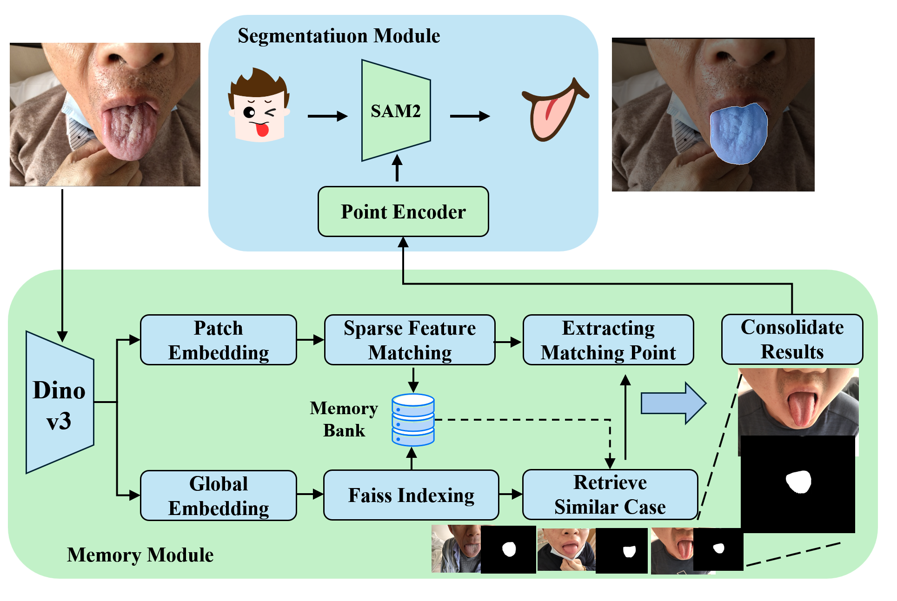
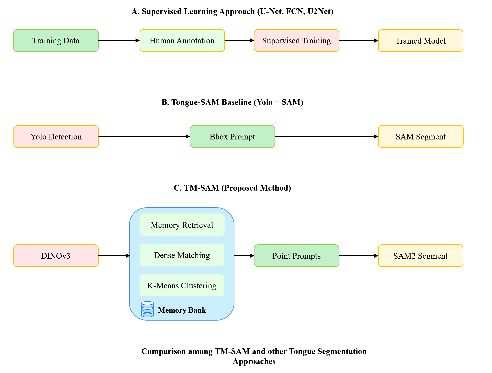
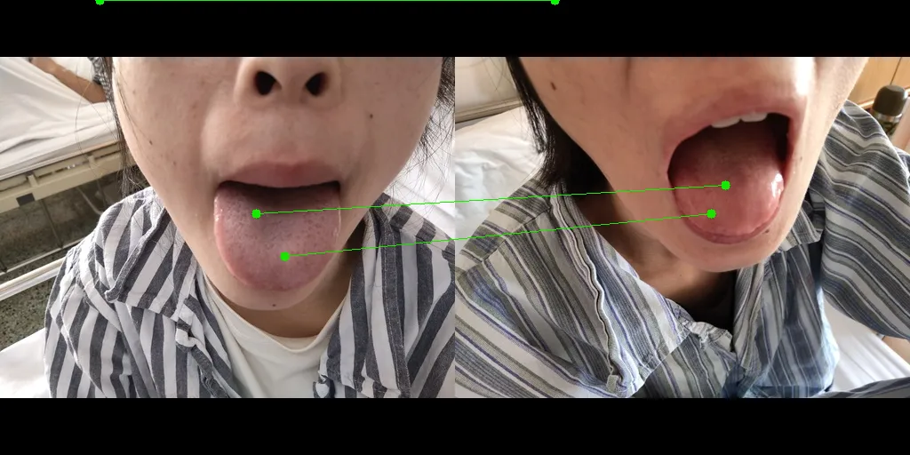
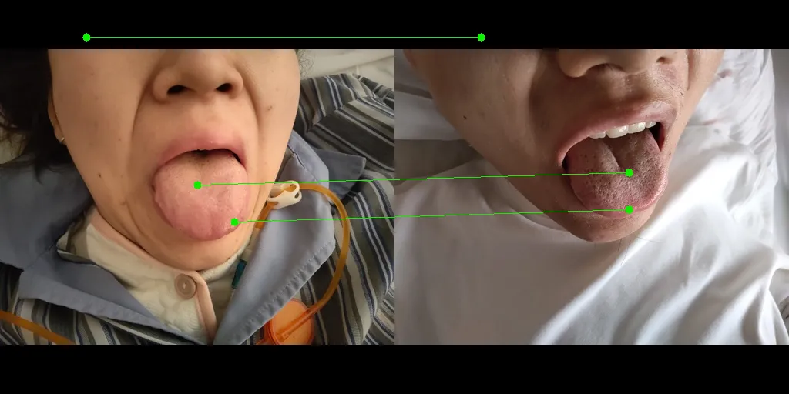

# Memory-SAM

**A novel memory-enhanced framework that integrates SAM 2, DINOv3, and memory-based retrieval for few-shot tongue segmentation in Traditional Chinese Medicine (TCM) diagnosis.**

# Notice
In the initial development version, due to permission requests in dino-v3, the weight file download was not implemented to occur in a single operation. An additional weight file download is required. https://github.com/facebookresearch/dinov3
The code will be modified in future updates to provide an English UI and enable immediate execution.

It can be used not only for TCM but also for general medical images and datasets such as COCO. Processing time is approximately 15 seconds per image at UHD resolution and approximately 3.5 seconds per image at 1024x768 resolution
## Abstract

Accurate tongue segmentation is crucial for reliable TCM analysis. Supervised models require large annotated datasets, while SAM-family models remain prompt-driven. We present **Memory-SAM**, a **training-free**, **human-prompt-free** pipeline that automatically generates effective prompts from a small memory of prior cases via dense DINOv3 features and FAISS retrieval. Given a query image, mask-constrained correspondences to the retrieved exemplar are distilled into foreground/background point prompts that guide **SAM2** without manual clicks or model fine-tuning. We evaluate on **600 expert-annotated images** (300 controlled, 300 in-the-wild). On a comprehensive test set, **Memory-SAM** achieves **mIoU 0.9863**, surpassing FCN (0.8188) and a detector-to-box SAM baseline (0.1839). On controlled data, scores above ~0.95 are practically saturated given annotation variability, while our method shows clear gains under real-world conditions. Results indicate that **retrieval-to-prompt** enables data-efficient, robust segmentation of irregular boundaries in tongue imaging.


*Figure 1: Overall architecture of Memory-SAM framework showing the integration of SAM 2, DINOv3, and memory system.*


*Figure 2: Comparison between traditional segmentation approaches and our memory-enhanced framework.*

## Key Contributions

- **Memory-Enhanced Segmentation**: Novel integration of memory-based retrieval with state-of-the-art segmentation models
- **DINOv3 Feature Extraction**: Utilization of advanced self-supervised vision transformers for robust feature representation
- **Few-Shot Learning**: Effective segmentation with limited training data through memory-guided prompting
- **TCM Application**: Specialized framework for tongue segmentation in Traditional Chinese Medicine diagnosis
- **Domain Adaptation**: Robust performance across varying imaging conditions and patient demographics

## Experimental Results

Our method demonstrates significant improvements in tongue segmentation accuracy compared to baseline approaches:


*Figure 3: Qualitative results showing superior segmentation quality with memory guidance.*


*Figure 4: Comparison of segmentation results across different tongue conditions and imaging scenarios.*

## Methodology

### Core Components

Our Memory-SAM framework consists of three integrated components:

1. **SAM 2 Segmentation Model**: Hiera architecture-based segmentation with prompt-guided inference
2. **DINOv3 Feature Extractor**: Self-supervised vision transformer for robust feature representation
3. **Memory System**: FAISS-based storage and retrieval of image features, masks, and similarity metrics

### Memory-Guided Segmentation Process

The segmentation process follows a five-step pipeline:

1. **Feature Extraction**: DINOv3 extracts both global (CLS token) and patch-level features from input images
2. **Memory Retrieval**: FAISS-based similarity search identifies the most relevant historical cases
3. **Prompt Generation**: Retrieved masks generate point and bounding box prompts for SAM 2
4. **Segmentation**: SAM 2 performs prompt-guided segmentation with multiple mask candidates
5. **Memory Update**: New results are stored in the memory system for future retrieval

## Requirements

- Python 3.11+
- NVIDIA GPU with CUDA 12.x support
- PyTorch 2.8+ with CUDA support
- Dependencies managed via `environment.yml` (Conda) and `pyproject.toml`

## Installation

### Environment Setup

1. **Create Conda Environment**
```bash
conda env create -f environment.yml
conda activate memory_sam
```

2. **Install Package (Development Mode)**
```bash
pip install -e .
```

3. **Download Pre-trained Models**

Download SAM 2.1 checkpoints to the `checkpoints/` directory:
- `sam2.1_hiera_large.pt` (recommended for best performance)
- `sam2.1_hiera_base_plus.pt` (for balanced performance/speed)

```bash
# Set checkpoint path via environment variable
export SAM2_CHECKPOINT=/path/to/sam2.1_hiera_large.pt
```

**Note**: SAM 2 models are from Meta AI. DINOv3 models will be automatically downloaded on first use.

## Usage

### Basic Inference

Launch the interactive interface:

```bash
python main.py --share
```

### Command Line Options

```bash
python main.py \
  --model_type hiera_l \
  --checkpoint_path /path/to/sam2.1_hiera_large.pt \
  --dinov3_model dinov3_vitl16 \
  --memory_dir ./memory \
  --results_dir ./results \
  --device cuda
```

### API Usage

```python
from memory_sam.memory_sam_predictor import MemorySAMPredictor

# Initialize predictor
predictor = MemorySAMPredictor(
    model_type="hiera_l",
    checkpoint_path="checkpoints/sam2.1_hiera_large.pt",
    dinov3_model="dinov3_vitl16",
    memory_dir="./memory"
)

# Process image with memory guidance
result = predictor.process_image(image_path, use_memory=True)
mask = result['mask']
confidence = result['confidence']
```

## Repository Structure

```
memory-sam/
├── checkpoints/                 # Pre-trained model weights
├── configs/                     # Model configuration files
├── figures/                     # Paper figures and diagrams
├── memory/                      # Memory storage (FAISS indices)
├── results/                     # Segmentation outputs
├── ui/                          # User interface components
├── memory_sam/                  # Core implementation
│   ├── memory_sam_predictor.py  # Main predictor class
│   ├── memory_system.py         # Memory management
│   ├── dinov3_matcher.py        # DINOv3 feature extraction
│   └── utils/                   # Utility functions
├── main.py                      # Interactive demo
├── environment.yml              # Conda environment
└── pyproject.toml              # Package configuration
```

## Performance Evaluation

### Quantitative Results

Evaluation on the HIT-Tongue-Image test set demonstrates the effectiveness of our memory-guided approach:

| Method | mIoU | mPA | Acc |
|--------|------|-----|-----|
| UNet | 0.9921 | 0.9961 | 0.9876 |
| FCN | 0.9919 | 0.9963 | 0.9975 |
| **U2Net** | **0.9969** | **0.9991** | **0.9990** |
| Tongue-SAM | 0.9724 | 0.9815 | 0.9889 |
| **Memory-SAM (Ours)** | **0.9833** | **0.9868** | **0.9944** |

