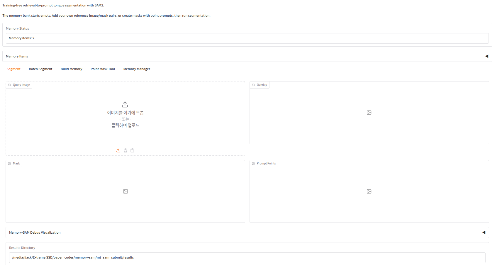

# Memory-SAM

**Memory-SAM: Memory-Augmented Retrieval-to-Prompt for Training-Free Tongue Segmentation**

Memory-SAM is a human-prompt-free retrieval-to-prompt framework for automatic tongue segmentation with SAM2. It uses a small user-provided memory bank of labeled reference images, retrieves transferable exemplars with DINOv3 descriptors, converts mask-constrained correspondences into foreground-only SAM2 point prompts, and returns tongue masks without interactive prompting at inference time.




## Highlights

- **Training-free at deployment:** no task-specific parameter optimization or fine-tuning is performed when using Memory-SAM.
- **Memory-augmented prompting:** users build a small labeled memory bank; Memory-SAM retrieves references and generates prompts automatically.
- **SAM2-based segmentation:** the default release uses SAM2.1 Hiera-L with foreground-only point prompts.
- **DINOv3 retrieval:** the default feature extractor is DINOv3 ViT-L/16 with Meta-approved weights.
- **Practical UI:** the release includes an English Gradio UI for memory creation, point-mask preview, single-image inference, batch inference, and memory management.
- **Public benchmark:** SM-Tongue Public Original512 contains **2,155** de-identified `512×512` image/mask pairs.

## Public Links

- Code: https://github.com/jw-chae/memory-sam
- Paper: https://arxiv.org/abs/2510.15849
- Dataset: https://huggingface.co/datasets/Mark-CHAE/SM-Tongue-Public-Original512

## Public Dataset

**SM-Tongue Public Original512** is released through Hugging Face.

- Samples: **2,155** image/mask pairs
- Image size: `512×512`
- Contents: input images, binary tongue masks, overlays, metadata, and checksums
- Intended use: reproducible research on automatic tongue segmentation

Download with the Hugging Face CLI:

```bash
pip install -U huggingface_hub
hf download Mark-CHAE/SM-Tongue-Public-Original512 \
  SM-Tongue-Public-Original512.tar.gz \
  SM-Tongue-Public-Original512.tar.gz.sha256 \
  --repo-type dataset
sha256sum -c SM-Tongue-Public-Original512.tar.gz.sha256
tar -xzf SM-Tongue-Public-Original512.tar.gz
```

## Repository Layout

```text
memory-sam/
  README.md
  requirements.txt
  figures/
    figure_architecture.png
    UI_figure.png
  mt_sam/
    features.py       # DINOv3 feature extraction
    memory.py         # FAISS memory bank and memory manager
    metrics.py        # Evaluation metrics
    paths.py          # Package-local path resolution
    predictor.py      # End-to-end Memory-SAM predictor
    prompting.py      # Retrieval-to-prompt generation
  scripts/
    build_memory.py
    download_assets.py
    evaluate_split.py
    export_public_dataset.py
    infer_image.py
    setup_assets.py
  ui/
    app.py            # Gradio UI
  assets/             # DINOv3 weights, not committed
  checkpoints/        # SAM2 checkpoint, not committed
  configs/            # SAM2 configs, not committed
  third_party/        # SAM2/DINOv3 source repos, not committed
  user_memory/        # User-created memory bank, not committed
  results/            # Output masks/overlays/metadata, not committed
```

## Installation

### Existing Workstation Environment

```bash
source /home/jjack/miniconda3/etc/profile.d/conda.sh
conda activate medsam_env
cd /media/jjack/Extreme\ SSD/paper_codes/memory-sam
```

This machine may not provide a global `python` command. Use `python3` globally, or use `python` only after activating the conda environment.

### Clean External Machine

```bash
git clone https://github.com/jw-chae/memory-sam.git
cd memory-sam

python3 -m venv .venv
source .venv/bin/activate
python3 -m pip install -U pip
python3 -m pip install -r requirements.txt
```

If using CUDA, install the PyTorch build that matches your CUDA driver before running Memory-SAM.

## Asset Setup

Memory-SAM requires SAM2.1 and DINOv3 assets. These are not committed to GitHub.

Expected runtime structure:

```text
memory-sam/
  checkpoints/sam2.1_hiera_large.pt
  configs/sam2.1/sam2.1_hiera_l.yaml
  third_party/sam2/
  third_party/dinov3/
  assets/dinov3_weights/dinov3_vitl16_pretrain_lvd1689m-8aa4cbdd.pth
```

On the original workstation, populate assets from the parent research workspace:

```bash
python scripts/setup_assets.py
```

Use copies instead of symlinks if needed:

```bash
python scripts/setup_assets.py --copy
```

For a clean external machine, download public assets and clone upstream source repos:

```bash
python3 scripts/download_assets.py
```

SAM2.1 Hiera-L is downloaded automatically from Meta's public URL. **DINOv3 weights are gated by Meta** and must be obtained by each user.

After DINOv3 access approval, use an approved URL:

```bash
python3 scripts/download_assets.py \
  --skip-code \
  --dinov3-weight-url '<URL_FROM_META_APPROVAL_EMAIL>'
```

or provide a local downloaded file:

```bash
python3 scripts/download_assets.py \
  --skip-code \
  --dinov3-weight-file /path/to/dinov3_vitl16_pretrain_lvd1689m-8aa4cbdd.pth
```

Official upstream sources:

- SAM2 code: https://github.com/facebookresearch/sam2
- SAM2.1 Hiera-L checkpoint: https://dl.fbaipublicfiles.com/segment_anything_2/092824/sam2.1_hiera_large.pt
- DINOv3 code/access: https://github.com/facebookresearch/dinov3 and https://ai.meta.com/dinov3/

Users must follow the upstream SAM2 and DINOv3 licenses and access terms.

## Launch Memory-SAM UI

Recommended command from the repository root:

```bash
python3 ui/app.py --device cuda
```

CPU fallback:

```bash
python3 ui/app.py --device cpu
```

Equivalent explicit command:

```bash
python3 ui/app.py \
  --memory-dir user_memory \
  --results-dir results \
  --sam-checkpoint checkpoints/sam2.1_hiera_large.pt \
  --sam-config configs/sam2.1/sam2.1_hiera_l \
  --dinov3-repo third_party/dinov3 \
  --dinov3-weights assets/dinov3_weights \
  --device cuda
```

Open the local Gradio URL printed in the terminal, usually:

```text
http://127.0.0.1:7860
```

## UI Workflow

### 1. Build Memory

The memory bank starts empty. Add user-owned reference examples before segmentation.

Options:

- `Build Memory`: upload a reference tongue image and its validated binary mask, then click `Add Reference To Memory`.
- `Point Mask Tool`: upload an image, click foreground/background points, inspect the live SAM2 mask preview, then click `Save Generated Mask To Memory`.

### 2. Segment One Image

1. Open the `Segment` tab.
2. Upload a query image.
3. Click `Run Memory-SAM`.
4. Inspect the overlay, binary mask, prompt-point visualization, retrieved reference, and similarity maps.

### 3. Segment A Batch

1. Open the `Batch Segment` tab.
2. Upload multiple images or enter a folder path.
3. Set a results directory.
4. Click `Run Batch`.

The UI writes masks, overlays, per-image metadata, and `batch_summary.json`.

### 4. Manage Memory

Open `Memory Manager` to:

- refresh the memory table,
- preview the reference image,
- preview the reference overlay,
- delete a selected item,
- clear all memory after typing `CLEAR`.

## CLI Usage

Single-image inference:

```bash
python3 scripts/infer_image.py \
  --image /abs/path/query.png \
  --out-mask results/query_mask.png \
  --out-meta results/query_meta.json \
  --device cuda
```

Build memory from a CSV manifest:

```bash
python3 scripts/build_memory.py \
  --manifest /abs/path/train_memory.csv \
  --memory-dir user_memory \
  --max-items 20 \
  --device cuda
```

CSV format:

```csv
image_path,mask_path
/abs/path/image_001.png,/abs/path/mask_001.png
/abs/path/image_002.png,/abs/path/mask_002.png
```

Evaluate a split:

```bash
python3 scripts/evaluate_split.py \
  --manifest /abs/path/test.csv \
  --memory-dir user_memory \
  --out-dir results/eval \
  --device cuda
```

Metrics reported:

```text
mIoU, mPA, Acc, Precision, Recall, Dice, IoU_fg, IoU_bg, latency_ms
```

## Method And Reproducibility Details

For each query image, Memory-SAM:

1. Resizes the input image to `512×512`.
2. Extracts DINOv3 ViT-L/16 global and dense descriptors.
3. Retrieves top memory references with exact cosine-similarity search.
4. Reranks retrieved references by foreground/background separability.
5. Quantizes the selected reference mask to the `32×32` DINO patch grid.
6. Computes foreground/background similarity maps `s_fg` and `s_bg`.
7. Builds the contrast map `S(i)=s_fg(i)-s_bg(i)`.
8. Selects the top `K=3` foreground-only contrast points.
9. Maps patch prompts to image coordinates by patch centers.
10. Runs SAM2.1 Hiera-L and selects the mask with the highest predicted IoU.
11. Applies fixed post-processing: largest connected component, hole filling, and morphology smoothing.

Important implementation notes:

- No model training or fine-tuning is performed by Memory-SAM at deployment time.
- The UI does not expose ablation settings.
- The memory bank is user-created and starts empty.
- For paper-style evaluation, never insert test images into memory.
- DINOv3 weights are gated by Meta and must be obtained by each user under official access terms.
- `mIoU` is the mean of foreground IoU and background IoU.
- Dice, Precision, and Recall are foreground-only metrics.

## Citation

If you use Memory-SAM or SM-Tongue, please cite the arXiv paper:

- Memory-SAM: https://arxiv.org/abs/2510.15849
